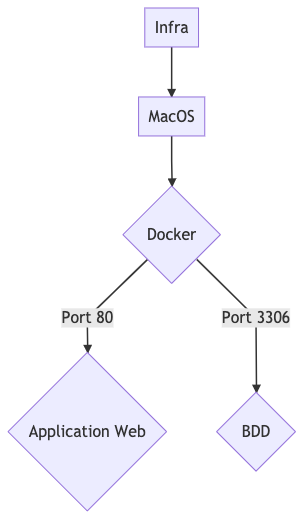

# Getting Started

## Description 

Le projet est un simple crud de gestion d'utilisateur

## Lancer le docker

`docker-compose up`

Ensuite la bdd est accessible par ligne de commande : `docker-compose exec database mysql -u root --password=password`
Le site web est accessible en `localhost:80`

## Mermaid

## DICT

