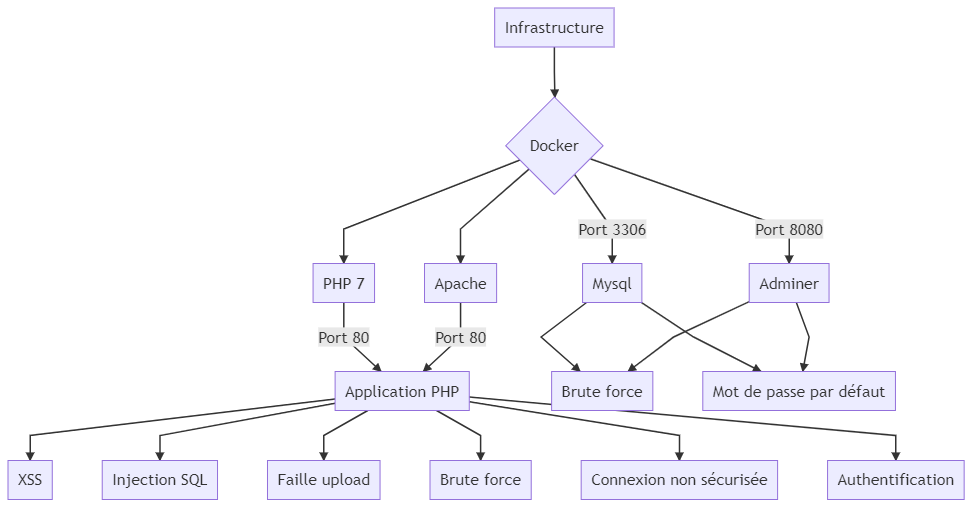

# TP Cybersecurité 

#  1. Contexte

### Présentation

Cette application est le rendu du projet de cyber sécurité de M1 III S1

Sujet: création d'un site vulnérable et analyse des failles.

### Sujet

- Le projet doit pouvoir être lancé avec une commande docker (et donc doit avoir un Dockerfile). 
   - Si la commande Docker ne fonctionne pas, la note sera sévère parce que je vais pas débugger le code de 30 personnes.
   - La commande doit apparaitre dans /README.md
- Le projet doit faire apparaitre un dossier /tests qui contiendra les tests unitaires qui permettraient de trouver les vulnérabilités dans votre code (vous avez carte blanche sur votre framework de test)
  - Par exemple : Un test d'injection SQL sur un paramètre GET
- Le projet doit faire un apparaitre un dossier /exploit qui contiendra les scripts qui permettront d'exploiter les vulnérabilités (vous avez carte blanche sur le langage du script, il faut que le script soit concis)
- Le projet doit être un dépôt github publique, pour que je puisse y jeter des coups d'oeil et pour les corrections
-  Le code doit être lisible et donc correctement commenté pour quelqu'un qui n'est pas dev (genre moi) mais qui sait lire de code (pas de "i++; // on incrémente i"). Si le code n'est pas propre et me fait perdre du temps quand je le lis, il y aura des malus.
- Le fichier README.md doit faire apparaitre les objectifs de sécurité de l'application :
  - Ses objectif en Confidentialité, Intégrité et Disponibilité (note /5)
- Le fichier README.md doit faire apparaitre un graph mermaidjs avec la surface d'attaque
- Un fichier Excel avec la même analyse de sécurité que le premier TP doit aussi apparaitre.

## 2.  Présentation 

### Fonctionnalites 

 - Connexion
 - Creation / modification / suppression / visualisation de users

### Technologies utilisées 

Le site web est réalisé avec PHP, HTML, CSS, Javascript, SQL

Le site se lance sur Apache et la base de données est gérée par Mysql

## 3. Installation & utilisation 

### Installation 

Il faut d'abord clone le projet disponible sur Github

Ensuite de projet se lance via Docker, le Dockerfile & docker-compose est disponible à la racine du projet. 

Ensuite pour lancer le projet, il faut lancer la commande : 

```
docker-compose up --build
```

L'application est ensuite disponible à l'adresse :
 
 `localhost:80`

 ## 4. Application. 

### XSS Stockee 

#### Explication
Du code JS est enregistrée dans la base de données. Celui ci est ensuite execute lorsque le code stocké est 'affiché' par le site.

#### Protection
Utilisation de `htmlspecialchars()` ou `htmlentities()` (PHP), qui permet de filtrer les '<' et '>'

Retirer tout le code HTML produit par l'application avant l'envoie au navigateur.

### Faille upload

#### Explication
Un utilisateur malveillant peut uploader un fichier contenant du code malveillant/php. Celui ci une fois appelé pourra exécuter le code saisie une fois appelé

#### Protection
Il est possible de verifier le type de fichier uploadé par l'utilisateur et de le valider ou non.
il est possible de renomer le fichier pour qu'il ne soit pas trouvable par l'utilisateur malveillant
Changer les droits du fichier avec chmod peut permettre de bloquer des fonctionnalites du fichier uploadé

### Brute force

#### Explication

C'est une méthode permettant de tester toute les combinaisons possible d'un mot de passe

#### Protection

Une des premieres protection est d'utiliser un mdp complexe, ce qui rendra presque impossible le tentatives de trouver le mdp
Il est possible de bloquer les comptes sur lesquels un bruteforce est remarqué (multiples requetes a detecter)
Il est possible d'utiliser des captchas, qui sont des tests de turing qui permettent de verifier si c'est un humain ou un "robot" qui tente de se connecter. Il est donc alors possible de bloquer les requettes intempestives.

### Connexion non securise

#### Explication

Les requetes ne sont pas sécurisées, il est donc d'analyser les requetes envoyées et de voir ce quelles contiennent

#### Protection

Utilisation d'un protocole HTTPS au lieu d'HTTP

### Authentification

#### Explication

L'authentification n'est pas controllée par les autres pages du site web, elles sont donc accessible à tout le monde

#### Protection

Utilisation d'un systeme de sessions gérée par l'application, qui vérifie si l'utilisateur est connecté pour accéder a certaines pages.

### Mot de passe par défaut

#### Explication

Le mot de passe de la base de données est laissé par défault (root)

#### Protection

 changer le mot de passe

### Injection SQL

#### Explication

Faille qui permet à un utilisateur malveillant de modifier les requetes SQL afin d'injecter un morceau de requete non prevu

#### Protection

Utilisation de procedures stocké au lieu de SQL dynamique
Vérifier les données saisie par l'utilisateur via `magic_quotes` (PHP)

 changer le mot de passe

## 5. Test & exploits

## 6) Sécurisation de l'application

### Mermaid : Surface d'attaque



