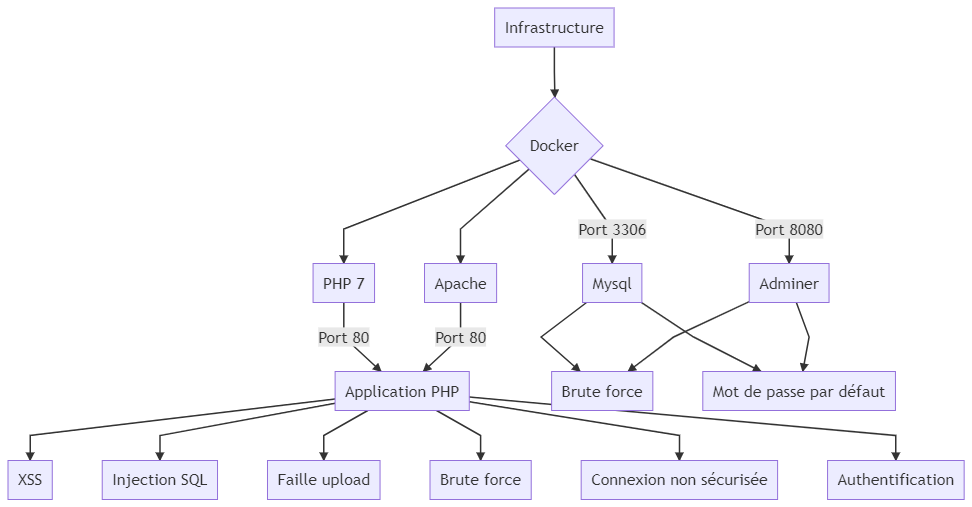

 

# Ping-Me

## 1) Contexte

### Explications / Présentation

Ce projet entre dans le cadre du cours de **CyberSécurité** du Semestre 1 de 1ère année de Master III à l'Université Catholique de Lille, FGES.

Le sujet est le suivant : création d'un site web volontairement vulnérable (**contenant des failles de sécurité**) et analyse de sécurité / propositions pour combler ces failles. Les technologies utilisées ainsi que les fonctionnalités proposées sont libres.

### To-do

- Le projet doit pouvoir être **lancé avec une commande docker** (et donc doit avoir un Dockerfile). 
   - Si la commande Docker ne fonctionne pas, la note sera sévère parce que je vais pas débugger le code de 30 personnes.
   - La commande doit apparaitre dans /README.md
- Le projet doit faire apparaitre un **dossier /tests** qui contiendra les tests unitaires qui permettraient de trouver les vulnérabilités dans votre code (vous avez carte blanche sur votre framework de test)
  - Par exemple : Un test d'injection SQL sur un paramètre GET
- Le projet doit faire un apparaitre un **dossier /exploit** qui contiendra les scripts qui permettront d'exploiter les vulnérabilités (vous avez carte blanche sur le langage du script, il faut que le script soit concis)
- Le projet doit être un **dépôt github publique**, pour que je puisse y jeter des coups d'oeil et pour les corrections
-  Le **code doit être lisible et donc correctement commenté** pour quelqu'un qui n'est pas dev (genre moi) mais qui sait lire de code (pas de "i++; // on incrémente i"). Si le code n'est pas propre et me fait perdre du temps quand je le lis, il y aura des malus.
- Le fichier README.md doit faire apparaitre les **objectifs de sécurité** de l'application :
  - Ses objectif en Confidentialité, Intégrité et Disponibilité (note /5)
- Le fichier README.md doit faire apparaitre un **graph mermaidjs** avec la surface d'attaque
- Un fichier Excel avec la même **analyse de sécurité** que le premier TP doit aussi apparaitre.

## 2) Présentation du projet

 

### Description

Ping-Me est un Site Web sur le thème du Tennis de Table. Il représente l'ébauche d'un **simulateur de compétition de Tennis de Table**.

Ce projet a été créé **à partir de zéro et uniquement pour le projet de Cybersécurité**.

### Fonctionnalités

- Inscription
- Connexion
- Création / modification des données de la raquette / des revêtements
- Visualisation d'un ratio [ victoires - défaires ]
- Affrontement avec d'autres joueurs
- Envoi de messages via un Chat

### Technologies utilisées

Le projet est un site web réalisé avec **PHP7, HTML, CSS, Javascript, JQuery, SQL**.

Le site se lance via **apache**.

#### Pourquoi ce choix

Ayant l'habitude de développer sous Symfony (framework PHP), je me suis rapidement dirigé vers ce choix car c'est avant tout un sujet sur le cybersécurité et non sur le développement en soit. (je voulais donc une **technologie sur laquelle j'étais le plus à l'aise**) J'ai délaissé le framework Symfony pour ce projet car beaucoup de failles sont comblées / empêchées par le framework. En PHP natif, créer des failles est beaucoup plus simple et approprié.

## 3) Installation et utilisation

<p align="center">
   
</p>

### Installation

Il faut tout d'abord cloner le projet git via la commande suivante :

`git clone https://github.com/GianniGiudice/Ping-Me.git`

Un Dockerfile est présent à la racine du projet et va permettre l'installation des dépendances du projet, à savoir :
- Apache
- Mysql
- PHP
- PHPUnit

Il installera également la base de données nécessaire au projet.

Pour lancer le docker, il faudra **se positionner à la racine du projet** et lancer la commande suivante :

```
docker-compose up --build
```

L'application sera alors accessible via navigateur à l'adresse suivante :

`127.0.0.1:8001/Pingme`

**/!\ Attention :** seuls les caractères alphabétiques sont acceptés pour l'inscription. Il faudra donc vous nommer par exemple "Loic" au lieu de "Loïc".

## 4) Deux applications différentes

<p align="center">
   
</p>

### Sécurisée

Branche « [main](https://github.com/GianniGiudice/Ping-Me/tree/main) »

La version de base est la version **"sécurisée"** dans le sens où on ne pourra pas y exploiter les failles disponibles via la branche "vulnerable" dont je parle dans la partie suivante.

### Vulnérable

Branche « [vulnerable](https://github.com/GianniGiudice/Ping-Me/tree/vulnerable) »

Une version vulnérable se situe sur la branche **vulnerable** et permet de tester différentes failles possibles sur une application web développée en PHP.

#### L'injection SQL

La faille d'injection SQL volontairement intégrée à cette branche va consister à permettre à l'utilisateur de modifier une requête SQL via un champ input.

On pourra par exemple créer un utilisateur dont le mail est test@test.com. Il sera possible de s'y connecter sans mettre le bon mot de passe en remplissant simplement le champ adresse mail par :

```
test@test.com';--
```

En mettant alors n'importe quel mot de passe, il sera possible de se connecter à ce compte. Cela fonctionne avec n'importe quelle adresse mail existante. 

Cette faille est très dangereuse car permet à un utilisateur aux mauvaises intentions de se connecter sur n'importe quel compte à condition qu'il en connaisse l'identifiant / l'adresse mail.

**NB :** Même si c'est un champ mail, il suffit de modifier le type du champ en **"text"** via l'inspecteur d'élément pour reproduire l'exploitation.

##### Explication

Dans notre code vulnérable, voici comment nous gérons la connexion d'un utilisateur :

```php
$sql = "SELECT * FROM user WHERE email = '" . $mail_address . "' AND password = '" . $password . "'";
$result = $this->executeRequest($sql);

if ($result->rowCount() > 0) {
    return true;
}
return false;
```

Et voici ce que donne ce code après l'entrée du pirate :

```php
$sql = "SELECT * FROM user WHERE email = 'test@test.com';--' AND password = '" . $password . "'";
$result = $this->executeRequest($sql);

if ($result->rowCount() > 0) {
    return true;
}
return false;
```

Ainsi, à cause des caractères **';** la requête se termine et les caractères **--** sont des commentaires en SQL et permettent d'ignorer la suite de la ligne.

Le script généré va donc tout simplement récupérer un utilisateur en ne vérifiant que son adresse mail.

##### Protection

Pour contrer la faille SQL, il suffit heureusement de mettre en place ce qui est devenu la norme depuis l'arrivée de PDO : **les requêtes préparées** qui n'interprètent pas les caractères spéciaux. En utilisant des requêtes préparées, vous ne pourrez plus avoir à faire avec des failles SQL.

#### Les mots de passe non cryptés

##### Explication

Un mot de passe non crypté en base de données est une vulnérabilité qui peut terriblement affecter les utilisateurs à la fois sur votre site mais également potentiellement sur d'autres applications. En effet, si un pirate parvient à accéder à votre base de données, il pourra récupérer les mots de passe de tous vos utilisateurs directement. Or, une grande partie des internautes utilise le même mot de passe pour plusieurs sites / applications. Une faille de ce type peut donc entraîner un effet domino. 

##### Protection

Pour crypter les mots de passe avant de les entrer en base, il existe de nombreuses méthodes différentes. Celle que j'ai utilisé est la méthode **password_hash** qui permet même de choisir l'algorithme que vous souhaitez utiliser pour crypter les mots de passe.

Pour connecter votre utilisateur, il faudra alors utiliser la méthode **password_verify** en lui renseignant le hash et le mot de passe entré par l'utilisateur danss le formulaire de login.


#### La faille XSS

La faille XSS volontairement intégrée via le Chat du site va par exemple permettre au pirate d'intégrer un script au site qui s'exécutera sur la page de tout utilisateur qui visitera la page où est affiché le Chat.

##### Explication

Dans notre code vulnérable, nous affichons tel quel ce que les utilisateurs entrent dans le champ input. 
Un pirate peut donc en profiter pour envoyer ce genre de message :

```html
<b>Bonjour</b>
```

Comme nous affichons telle quelle l'information, le pirate aura réussi à.. afficher son message en gras. Rien de bien grave mais s'il peut intégrer du code via votre formulaire, il pourra également entrer ce genre de message :

```javascript
<script>alert("Hello");</script>
```

Et oui, le code javascript sera effectué à chaque visite de la page. Ainsi, le pirate aura réussi à afficher une pop up à chaque fois qu'un utilisateur visitera la page où le Chat est affiché, à savoir la page d'accueil.. Assez dérangeant donc.

Et les choses peuvent aller bien plus loin car s'il parvient à insérer du code javascript, il pourrait alors très bien récupérer des cookies de session, rediriger l'utilisateur vers un site pirate, etc..

Les possibilités sont très nombreuses et potentiellement destructrices.

C'est pour cela que cette faille n'est pas à prendre à la légère. Heureusement, elle se comble facilement.

##### Protection

En PHP, pour prévenir ce genre de faille, il suffit d'utiliser la méthode **htmlentities** ou encore la méthode **htmlspecialchars** qui vont encoder les caractères spéciaux avant de les intégrer à la page, rendant ainsi les balises non interprétables.


```php
<?= htmlentities($message['message']) ?>
```

#### La faille http (pas de certificat SSL)

L'application n'est accessible qu'en http et non en **https**. Qu'est-ce que cela implique ? Lorsque l'on intègre un **certificat SSL** à un site et qu'on le passe en https, toutes les requêtes sont **cryptées**. A l'inverse, en http, les informations des requêtes passent en clair sur le réseau. Il est alors par exemple possible de **sniffer** le réseau et de récupérer un mot de passe en clair lorsqu'un utilisateur se connecte à un site en http via le même réseau que nous. 

C'est une faille très dangereuse sur un réseau public.

<p align="center"></p>

Pour la combler, il suffit donc de passer son site en https. Pour cela, il faut **acheter un certificat SSL**, l'installer sur votre serveur et rediriger votre site sur le **port 443**. (contre 80 en http)

## 5) Tests et exploits

<p align="center">
   
</p>

Pour les tests unitaires, le framework **PHP Unit** est utilisé.

Un dossier **tests** et un dossier **exploits** sont disponibles à la racine de projet (**Note :** Uniquement sur la branche [vulnerable](https://github.com/GianniGiudice/Ping-Me/tree/vulnerable)) et contiennent les tests unitaires ainsi que leurs exploitations.

Pour lancer les tests, il faut lancer la commande suivante :

```
vendor/bin/phpunit tests/*
```

## 6) Sécurisation de l'application

### Diagramme Mermaid : Surface d'attaque



### Les critères DICT

|  Disponibilité - **1/5**  |  Intégrité - **5/5**  |  Confidentialité - **4/5**  |  Traçabilité - **2/5**  |
|-----------------|-------------|-------------------|---------------|
|  Il n'y a aucune information visible de la part d'un joueur sur les autres joueurs du jeu. Il peut uniquement voir la liste des autres joueurs ainsi que leur ratio [victoires - défaites]. Ce dernier pouvant indiquer si un joueur est plutôt fort ou faible, cela peut être intéressant pour le choix d'adversaire lors d'une compétition.  |  Il est très important pour un joueur que ses données (notamment le matériel) ainsi que celles des autres joueurs (ratio compétition) restent inchangées et exactes car ayant peu d'informations, il est primordial que celles-ci soient les bonnes.  |  Il est important pour un joueur de ne pas voir ses informations sur son équipement actuel dévoilées aux autres joueurs. Il serait alors trop facile aux joueurs de choisir leurs adversaires en prenant les combinaisons les plus faibles.  |  Dans le cadre d'une application de simulation d'un joueur de tennis de table, il n'est pas essentiel d'avoir un historique des actions menées par le joueur et / ou ses adversaires. Il serait cependant intéressant pour lui de pouvoir consulter un historique de ses victoires / défaites avec les statistiques de sa raquette / de ses revêtements à chaque match afin qu'il puisse étudier quelle est la meilleure combinaison possible.  |
